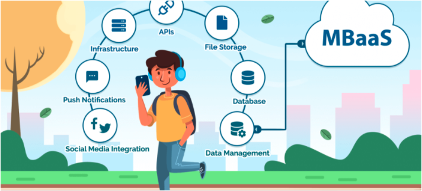
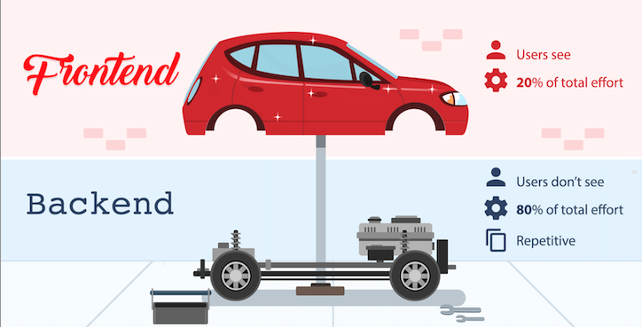
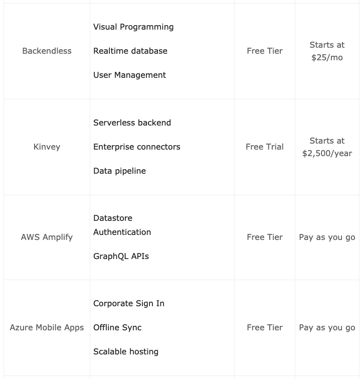

## What is a backend as a service?

A BaaS or mBaaS or Backend as a Service is a platform that automates backend side development and takes care of the cloud infrastructure. Using a BaaS, you will outsource the responsibilities of running and maintaining servers to a third party and focus on the frontend or client-side development.

On top of that, a BaaS will provide tools to help you create a backend code and speed up the development process. It has ready to use features like scalable databases, APIs, cloud code functions, social media integrations, file storage, and push notifications.

### Frontend vs. Backend

First things, first! Here is a simple explanation of the differences between the frontend and backend.

- Frontend: Every software application has a section that the user sees that is called the frontend.
- Backend: There is also a part that the user does not see that is named backend. These two portions combine through APIs.

Please refer to Wikipedia know more about Frontend vs. Backend.

### BaaS vs. Custom Backend

For every app you build, there is a choice to develop it, creating a custom backend, or using a BaaS framework. Let’s understand the difference between these two approaches.

Going for a custom backend, you will have to create your backend from scratch and handle the infrastructure. The pros of this approach are the flexibility it provides and customization possibilities. The downsides will be higher development costs and a longer time to market.

On the other hand, a BaaS will deliver ready to use building blocks and code generation tools. The advantages of this approach are a much faster development process and reduced time to market. The cons will be lower flexibility and following a standardized architecture.

The following examples will help you to understand the differences between custom coding and using a BaaS.

#### Example 01 – BaaS vs. AWS EC2 Instances

Imagine you would like to build a new software project and that you will not use a BaaS. The first step before you start developing the backend side code is to set up the servers. Here is how it will work:

- Login on AWS or any other cloud.
- Go to Instances
- Launch Instance
- Select the Operating System
- Instance Size, Type
- Configure Instance Details
  - Number of instances
  - Network
  - IP
  - Monitoring
  - Other settings like Auto Scaling, IAM, etc
- Add Storage
- Security Settings

All right, your instance is up and running, and now you can start coding! Not really! That is only the first step of the process, and you will still need to install the web-server, database, framework, etc. After all that is done, you can start coding. The time to perform this process can range from a few hours (for a small project with skilled backend developers) to more than a day for large environments.

This same process using a backend as a service will be done with a few clicks and take no more than a few minutes.

#### Example 02 – BaaS vs. Custom coding Login feature

Imagine that after your server setup is ready and you want to develop your application’s first feature. Let’s consider the first feature you will code is a social login to Facebook. I will assume outsourcing development to an offshore company, which will cost $25/hour. This simple task will take around 16 hours and cost $400.

On the other hand, using a BaaS will allow you to implement the same feature in less than one hour. You will have a saving of 15 hours and $375. Not bad for a simple task implementation!

#### Example 03 – GDPR security settings

GDPR privacy requirements are pretty complicated, and the implementation will demand a lot of engineering effort. The requirements will range from implementing HTTPS for transit data to encrypt server-side data in rest (and several other conditions). The exact amount of engineering hours to fulfill all the elements will depend on the project’s size and complexity, but can easily surpass 100 hours of implementation.

Outsourcing this implementation to a backend as a service company makes sense, especially for small to medium projects. Because the backend platforms can dilute the investment made to implement GDPR settings among hundreds or thousands of apps, the stake per app will be minimal. A company with a single project will have to offset all the investments under only one application. Even if the app is successful, it will demand much more time to return the investment.

### BaaS vs. MBaaS

BaaS and MBaaS are pretty much the same things! You can use a backend as a service for web projects or mobile projects. It’s recognized as a mobile backend as a service (MBaaS) or mobile BaaS when used for mobile development. 

Why use a backend as a service?
A BaaS platform will help you to solve two problems: 

Manage and scale cloud infrastructure
Speed up backend development
There are many benefits of using a BaaS cloud, and the reasons to use a backend as a service classifies into business and technical aspects. 

## Why use a backend as a service?

A BaaS platform will help you to solve two problems: 

- Manage and scale cloud infrastructure
- Speed up backend development

There are many benefits of using a BaaS cloud, and the reasons to use a backend as a service classifies into business and technical aspects. 

### Business reasons to use a BaaS

The business advantages of a backend as a service are mainly related to productivity gains and outsourcing cloud management responsibilities. In particular, for small to medium size projects, you will have substantial benefits using a backend platform. The math is pretty simple; a backend/infrastructure engineer will cost around $80k/year in the USA. Outsourcing part of the work to a third party will allow offsetting this cost.

The other advantage is delivering faster time to market to a software project. Waiting for several months to provide a software product will kill the market opportunity or make you start behind the competition. So, the business advantages of a BaaS are:

- Reduce time to market
- Save money and decrease the cost of development
- Assign fewer backend developers to a project (same results with fewer developers)
- Outsource cloud infrastructure management

### Technical reasons to use a BaaS

Good backend developers are difficult to find and are well-paid professionals. If you find one of them, make sure you use their time wisely and ask them to deliver high-value code. Programming, repetitive activities, and boilerplate code is a waste of time and money. So, it has to be avoided.

The other advantage of a backend service is that it will let your frontend developers concentrate on what they are best at. That is, delivering frontend code and excellent usability for your application. So, the technical advantages of a BaaS are:

- Focus on frontend development
- Excludes redundant stack setup
- No need to program boilerplate code
- Standardize the coding environment
- Let backend developers program high-value lines of code
- Provides ready to use features like authentication, data storage, and search
- Let you clone apps and run testing environments
- Focus on coding business logic rather than boiler plate code 
- Has ready to use security settings and backup procedures

## When to use a backend as a service?

Here are three everyday use cases for using a backend as a service platform:

- Making an MVP – Minimum Viable Product
- Stand-alone apps or applications that require a small number of integrations
- Enterprise apps that are not mission-critical

For these cases, using a BaaS is a no-brain and will save you a lot of time and money.

### Advantages and Disadvantages of a BaaS

Here are the pros and cons of using a backend as a service.

Advantages of a Backend as a Service

- Development speed – It’s super fast
- Development price – It’s really cheap
- It’s serverless, and you don’t need to manage infrastructure

To know all the benefits of using a BaaS, please read: BaaS – 22 Benefits https://blog.back4app.com/2019/10/24/what-are-the-benefits-baas-backend-as-a-service/ you will enjoy

### Disadvantages of a Backend as a Service

- Less flexibility in comparison to custom coding
- A lower level of customization in comparison to a custom backend
- Vendor lock-in for closed source platforms

## IaaS x PaaS x BaaS

Every time you move from IaaS to PaaS and from PaaS to BaaS, you add layers of service (or segments of value) to your application. Here is a simple overview:

- IAAS = Data Center + Servers + Storage +Networking
- PAAS = IAAS + Deploy + Manage + Scale
- BAAS = PAAS + Features to Build Backend

## What features have a backend as a service?

A backend as a service will provide you with features that can be deployed across all types of applications. Here are the most common features of a backend as a service.

- Scalable Database (NoSQL or SQL)
- APIs (GraphQL and REST)
- Business Logic via Cloud Code Functions
- User authentication
- Social Integration (Facebook, LinkedIn, Twitter, etc.)
- Email Verification
- Push Notifications
- Geolocation
- Database Graphical User Interface (GUI)
- Logs
- CDN and Cache
- Infrastructure (Security settings, auto-scaling, data backup, DB optimization)

## How does a BaaS architecture look like?

Generally speaking, a mobile backend as a service architecture is divided into three different layers.

The first layer is the foundation and contains the database servers. A database cluster will have at least two servers to replicate data and a backup routine to retrieve data.

The second layer is the application cluster and contains multiple servers to process requests. The quantity of servers fluctuates throughout the time of the day, and auto-scaling procedures are necessary to fulfill the group with the correct amount of servers.

The third layer connects the application servers to the Internet, and it’s composed of load balancers and CDNs.

## What types of projects run best on a Backend as a Service?

- Real-time applications (chat, messaging apps)
- Transportation apps (similar to Uber)
- Social-network type  apps
- Ecommerce apps
- Music or Video streaming apps
- Games

## BaaS Providers and features

Refer to https://blog.back4app.com/backend-as-a-service-baas/

### BaaS Providers Comparison

