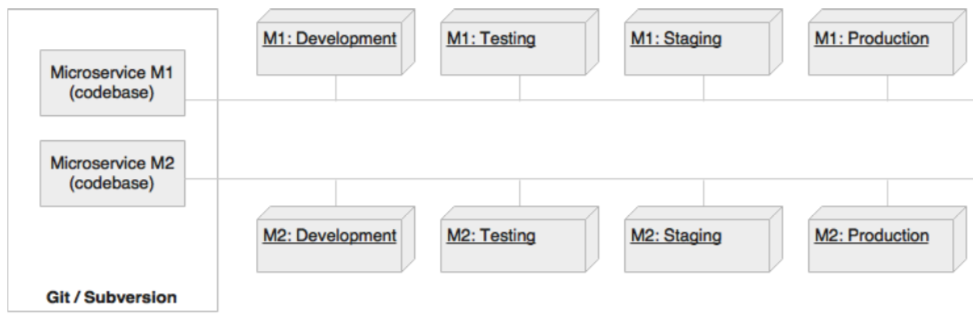
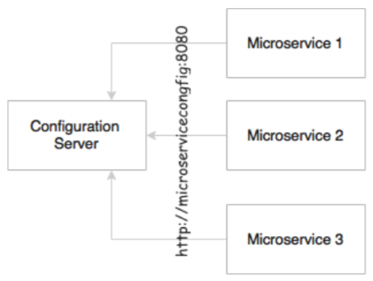
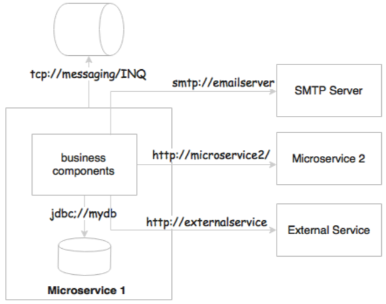
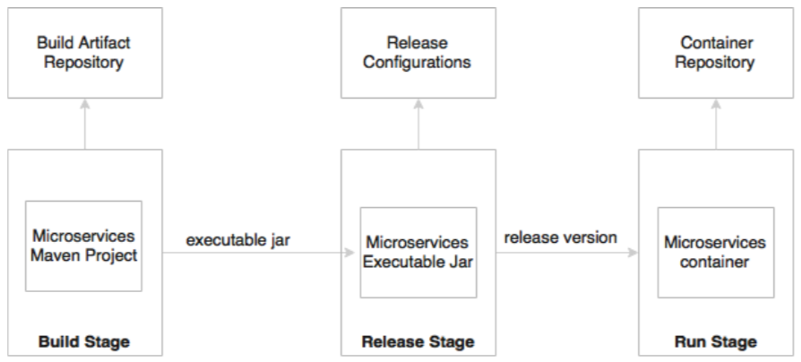
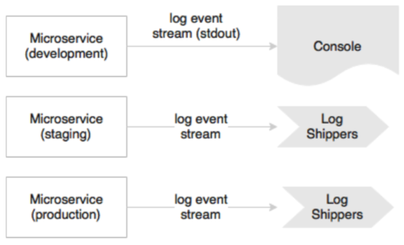

## 1. Single code base

Extending the same philosophy for microservices, each microservice should have its own code base, and this code base is not shared with any other microservice. It also means that one microservice will have exactly one code base.

## 2. Bundle dependencies

## 3. Externalizing configurations

The Externalize configurations principle gives you an advice to externalize all configuration parameters from the code. An application's configuration parameters vary between environments such as support email IDs or URL of an external system, username, passwords, queue name, and more. These will be different for development, testing, and production. All service configurations should be externalized

## 4. Backing services are addressable

All backing services should be accessible through an addressable URL. All services need to talk to some external resources during the life cycle of their execution. For example, they could be listening to or sending messages to a messaging system, sending an email, or persisting data to a database. All these services should be reachable through a URL without complex communication requirements

## 5. Isolation between build, release, and run

## 6. Stateless, shared nothing processes

## 7. Expose services through port bindings

A Twelve-Factor App ideally does  not relay on an external web server. A HTTP listener, such as Tomcat,  Jetty, and more, has to be embedded in the service or application itself.

## 8. Concurrency for scale out

In the microservices world, services are designed for a scale out rather than scale up.

## 9. Disposability, with minimal overhead

In the microservices context, in order to achieve full automation, it is extremely important to keep the size of the application as thin as possible, with minimal startup and shutdown times. Microservices should also consider lazy loading of objects and data.

## 10. Development, production parity

The development, production parity principle states the importance of keeping the development and production environments as identical as possible. For example, let's consider an application with multiple services or processes, such as a job scheduler service, cache services, or one or more application services. In a development environment, we tend to run all of them on a single machine. Whereas, in production, we will facilitate independent machines to run each of these processes.

## 11. Externalizing logs

If the I/Os are not fast enough in a given infrastructure, they could create a bottleneck. The solution to this is to use a centralized logging framework. **Splunk, greylog, Logstash, Logplex, Loggly** are some examples of log shipping and analysis tools. The recommended approach is to ship logs to a central repository by tapping the logback appenders and write to one of the shipper's endpoints.

## 12. Package admin processes

Apart from application requests, most of the applications provision for admin tasks. This principle advices you to target the same release and an identical environment as the long running processes runs to perform these activities. Admin code should also be packaged along with the application code.
