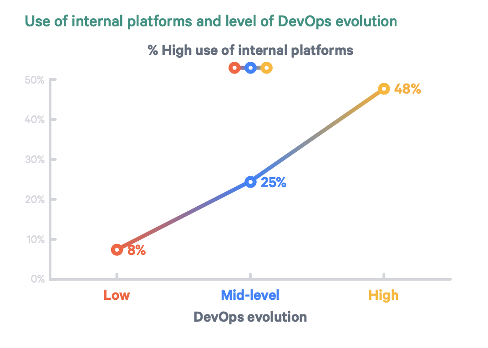
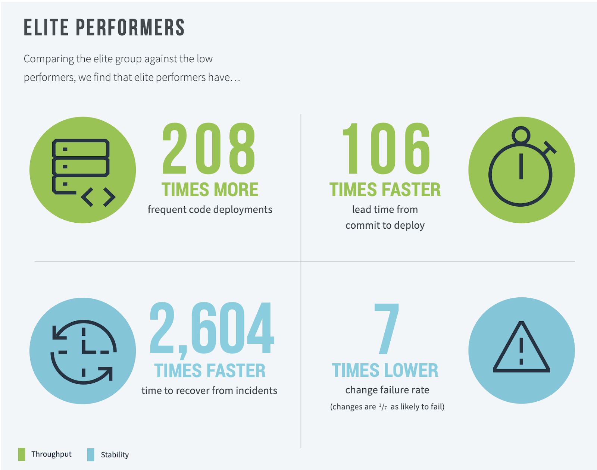
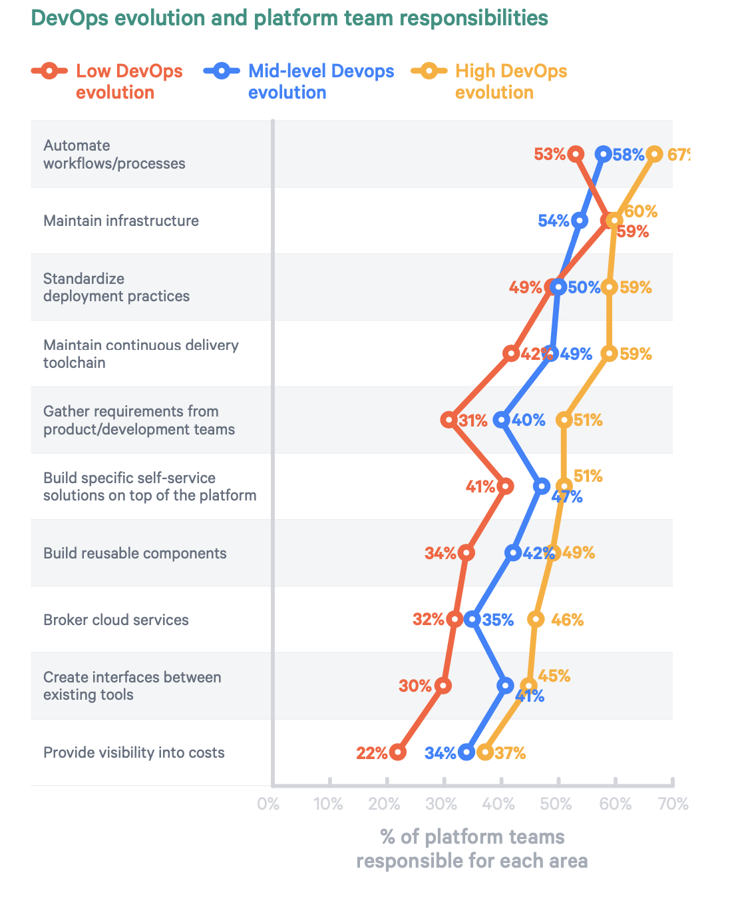
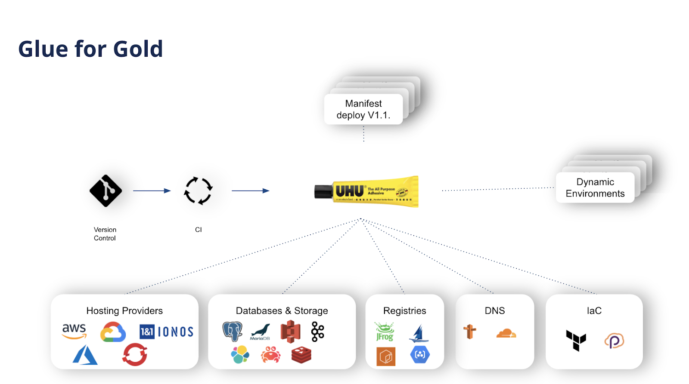

The early 2000s, the era of the SysAdmin. They were the ultimate rulers of the infrastructure, the gatekeepers of any setup. If your app developers wanted anything done, they needed to pass through them. Specifically, this meant every script and piece of code was thrown over the fence to SysAdmins to figure out what to do with it and how to deploy it. Not a great experience on either side of the fence. Then 2007 came and Werner Vogels [famously yelled](https://queue.acm.org/detail.cfm?id=1142065): “You build it, you run it”. And a whole generation of SysAdmins was fired. Cloud native was finally allowing developers to provision the resources they needed, whenever they needed them. The answer to every dev teams’ problems. Or was it?

While it did bring about a plethora of improvements around scalability, availability and ease of operation, it turns out Cloud native also meant things got a lot more complicated. As every company’s value proposition becomes digitized ([as Twilio’s CEO explains](https://www.youtube.com/watch?v=ZAKn9qkYEwU&t=1978s)), the degree of complexity of its systems grows exponentially. They suddenly need to integrate with countless new technologies, be deployed across multiple clusters and vendors in different regions, all while offering an effortless end experience to customers. The result of all of this is that your frontend app developers are completely overwhelmed by the sheer amount of tools that make up your infrastructure. And whenever they are supposed to be using those YAML files for their deployments, they end up going to your Ops team to ask for help. So much for “you build it, you run it”.

## The key to true DevOps

Once they realized this approach to DevOps just wasn’t going to scale the way they needed it to, top-tier engineering organizations started looking at alternative solutions. In order to grow rapidly, while keeping their systems reliable and maintainable, and without compromising their developers' end experience of working with the infrastructure, leading tech organizations introduced Internal Platform teams.

Platform teams build internal workflows and tooling, such as [Internal Developer Platforms (IDPs)](https://humanitec.com/blog/what-is-an-internal-developer-platform), to ensure application developers are shielded from the evolving complexities of the underlying infrastructure. They create a smooth development and deployment experience for everyone involved.

The common thread in everything they do: enable developer self-service across the organization. As Skelton and Pais explain in [Team Topologies](https://teamtopologies.com/book), 

“The Platform team’s knowledge is best made available via self-service capabilities via a web portal and or/programmable API [i.e. an IDP] (as opposed to lengthy instruction manuals)”. 

[The 2020 State of DevOps report by Puppet](https://puppet.com/resources/report/2020-state-of-devops-report/) clearly surfaces this by mapping the level of DevOps sophistication against the use of self-service platforms built by Platform teams.

Source: [2020 State of DevOps report by Puppet](https://puppet.com/resources/report/2020-state-of-devops-report/)

Jason Warner, CTO at GitHub, [explained in his interview with us](https://humanitec.com/blog/jason-warner-why-github-built-their-own-internal-developer-platform) how building their platform team and their IDP wasn’t really a cosmetic choice but rather a vital move on their part, which allowed GitHub to scale the way they did. Jan Löffler, Head of Platform at Zalando (largest e-commerce in Germany), [agrees that an Internal Platform team](https://humanitec.com/blog/why-zalando-builds-an-own-developer-platform), in combination with an Internal Developer Platform, is an essential component of what makes such a large organization function and ship software so much faster than a regular team.

## Impressive impact

The strategic focus on Platform teams and developer self-service in these elite organizations clearly pays off. The results of well-trimmed Internal Platform teams are quite astounding: top performers deploy a stunning 208 times more frequently than low performers. [The 2019 Accelerate State of DevOps Report](https://services.google.com/fh/files/misc/state-of-devops-2019.pdf) shows very interesting data on the top percentile teams:

Source: [2019 Accelerate State of DevOps Report](https://services.google.com/fh/files/misc/state-of-devops-2019.pdf)

While these “elite performers” only make up for a fraction of the market, this trend is catching the attention of many others. According to the [2019 Gartner DevOps report](https://www.gartner.com/en/documents/3906678/how-to-scale-devops-by-building-platform-teams), IDPs and Platform teams are increasingly the go-to approach to solve problems holistically and handle multiple teams and applications, instead of just the projects at hand. According to this report, 60% of surveyed teams are currently embarking onto the platform journey.

We have already written at length about [the rise of Internal Developer Platforms](https://humanitec.com/blog/the-rise-of-internal-developer-platforms) in the industry and [what they are](https://humanitec.com/blog/what-is-an-internal-developer-platform). A match made in DevOps heaven, IDPs are the indispensable companion of any Platform team. Together, they provide app developers with the best tools and workflows to do their job as efficiently and effortlessly as possible. 

**In this article**, we will dive deeper into the Platform team side of things: the different aspects of building and scaling one, while ensuring that it continuously generates value for all your app dev teams.

## How to build an Internal Platform team

Alright, Internal Platform teams are pretty damn important when your organization is scaling up. And if that’s you, right now you might be thinking to yourself you need one. So where do you start?

### The mission

As usual, from the why. When building an Internal Platform team, it is key you clearly define its purpose and mission. “To build the tools (IDPs) that enable developers to shio scalable applications with high speed, quality and performance” is an example. Whatever makes the most sense for your organization, make sure you set this in stone. Along with the mission statement, it is important you establish early on that the Platform team is not to be seen as some sort of extension of the SRE or Ops teams, but rather as its own product team, serving customers (app developers) within your organization.

This differentiation is crucial not only from an engineering and product point of view, but also from a management perspective. In order to get buy-in on different levels, Platform teams cannot afford to be speaking only the technical language, but need to master the business lingo too. It is critical for the long term success of any Internal Platform team that it gets seen within the organization as not yet another cost center we are adding to our already expensive engineering balance sheet. Instead, it is a value center for all other app development teams and, eventually, for the end consumer.

### Internal balance

Once that is cleared up, you need to strike the right balance. Successful Internal Platform teams manage to put in place strong guardrails and standards for their development teams, but without taking away too much of their autonomy. To have meaningful impact, Platform teams depend on having standards in their organization. Trying to support every possible programming language, framework, DB, and whatever exotic tech engineers like that month only results in Platform teams spreading themselves too thin. On the flip side, you don’t want to come across as a patronizing ruler of infrastructure by imposing your standards on every other team. [Standards vs. freedom](https://humanitec.com/blog/devops-standards-vs-freedom) is a complex topic we have covered before. There’s no one-size-fits-all solution here, but you have to be mindful of the challenges of introducing a centralized set of standards in your organization.

Finally, ensure you select the right SREs and DevOps engineers to build out your team. This sounds obvious, but there’s quite some [debate around what makes for a good Platform engineer](https://www.reddit.com/r/sre/comments/m12sdl/becoming_a_platform_engineer/). It is paramount he or she fully appreciates internal tooling as a real product to iterate on, based on the feedback of their end customer: the rest of the engineering teams. Deep technical capabilities like language skills are key for a Platform engineer, but make sure you don’t only consider technical sophistication when hiring for this position, also look for candidates with a multidisciplinary understanding of their role within the organization. Alongside these core Ops competencies, you’ll also need front-end and design roles to build a complete Platform team. Remember, they are building a full fledged product for your organization. 

### The value(s) of Platform teams

Congratulations, you convinced management to give you the green light and went off to build a world class Internal Platform team. So how do you make sure it was all worth it? At the end of the day, they are not shipping anything that’s customer facing, so how do you know they are working on the right things to maximize value for the rest of the engineering org?

We compiled the key areas that we have seen Internal Platform teams focus on, in order to deliver the right internal tooling, standards and workflows to their application developers. The cornerstone is always the reduction of complexity and cognitive load for the end user of the Internal Developer Platform. If that is unstable, your engineering productivity will drop dramatically. But let’s get into the details.

### Treat your platform as a product

We mentioned this already, but it is probably the most important takeaway: your Internal Platform team needs to be driven by a [product mindset](https://martinfowler.com/articles/talk-about-platforms.html). They need to focus on what provides real value (as opposed to what is “cool” to work on) for their internal customers, the app developers, based on the feedback they gave them. This philosophy needs to be drilled into every aspect of your Platform team’s activities. Iterate on your Internal Developer Platform, ship new features. At the same time, don’t forget you are also responsible for maintaining a reliable and scalable Ops setup. If something goes wrong in your team, all other teams will suffer from it.

Source: [2020 State of DevOps report by Puppet](https://puppet.com/resources/report/2020-state-of-devops-report/)

### Optimize iteration speed

When you think about it, the speed at which your organization innovates is directly correlated to (and constrained by) your iteration speed. Increase that, and your app developers will be able to consistently ship more features and products to your customers, confident that things won’t break.

In order to do so, Internal Platform teams need to focus on optimizing every step of the software delivery process. In particular, they should:

- Make local development and testing as fast and painless as possible
- Critically simplify the way developers interact with their infrastructure (and remove the [zoo of scripts](https://humanitec.com/blog/tame-your-zoo-of-scripts) from their day to day)
- Lower barrier to entry by building the right tools and documentation that enable engineers to onboard faster. You should move away from tribal knowledge as much as you can.

### Solve common problems

A good Platform team prevents other teams from reinventing the wheel by solving common problems time and again. It’s key to figure out what these common problems are: start by understanding developer pain points and friction areas that cause slowdowns in development. You can gather this information both qualitatively through developers’ feedback and quantitatively via engineering KPIs. This intel, combined with an understanding of the future direction of the product, can help the Internal Platform team shape a good roadmap and pick the right battles to fight. The Puppet report gives us some insights on what the core responsibilities of Platform teams are.

Source: [2020 State of DevOps report by Puppet](https://puppet.com/resources/report/2020-state-of-devops-report/)

### Be glue, my friend

Platform teams need to define a golden path for their developers: a reduced set of sane, proven choices of tools that get the job done and allow you to build, deploy, and operate your services. Once you have defined this path, the main value you create as an Internal Platform team is to be the sticky glue that brings all the tools together and ensures a smooth development and deployment experience for your engineers.

It’s important you don’t go to war with commercial vendors. It doesn’t matter if your homegrown CI/CD solution is superior today. AWS, GCP, Humanitec will catch up, faster than expected, and make that tool and team redundant. Every Platform team should be asking themselves: what is our differentiator? Instead of building in-house alternatives to a CI system, a CD tool or a metrics platform and compete against businesses that have 20 or 50 times your capacity, focus on the specific needs of your teams and tailor off-the-shelf solutions to your requirements. Commercial competitors are more likely to optimize for more generic needs of the industry anyway.

### Educate and empower your teams

Finally, a good Platform team is a central source of education and best practices for the rest of the company. Some of the most impactful activities we saw elite teams routinely perform in this area include:

- Fostering regular architectural design reviews for new functional projects and proposing common ways of development across dev teams.
- Sharing knowledge, experiences and collectively define best practices and architectural guidelines.
- Ensuring engineers have the right tools in place to validate and check for common pitfalls like code smells, bugs and performance degradations.
- Organizing internal hackathons so dev teams can surface their requirements for internal tooling needs. Nigel Simons (Director Enterprise Tech at a Fortune 100) explained in a [conversation with us](https://humanitec.com/blog/developer-experience-roundtable-continuous-improvement-nigel-simpson-erik-muttersbach) that 50% of their teams’ hackathon ideas actually make it to production.

## Summary

If you and your team are scaling up your infrastructure and adding engineers at an increasing pace, you are likely considering (or hopefully will consider, after reading this) to build an Internal Platform team. The benefits can be many and if done right, a Platform team can allow your organization to scale considerably faster and more efficiently than with a less standardized approach and product driven mentality.
