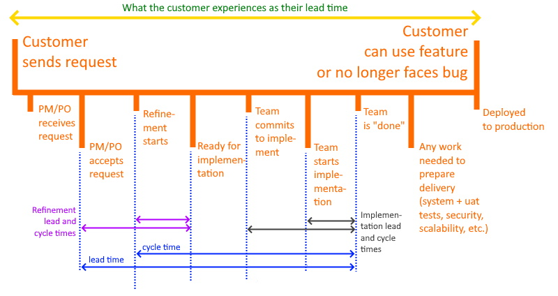
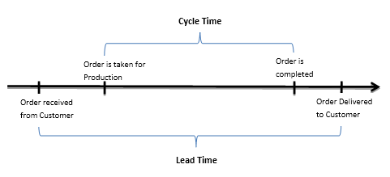

> #### What Is Cycle Time?
>
> In Kanban, cycle time is defined as the time it takes from when you start work on a [user story](https://www.digite.com/agile/user-stories/) that’s ready for implementation, to when it’s ready for delivery (release).
>
> In terms of Kanban board columns this is the time from when you move a card from “Ready” (“To do”) to “In progress” (“doing”) to the time when you move that card from “In progress” to “Done”.
>
> Of course, user stories aren’t the only work on a Kanban board and you can measure cycle time for all tasks you track on a Kanban board. For example, bugs that need fixing or research you need to do before you can proceed with a user story or bug fix.
>
> However, if you want to look at cycle time in relation to lead time, you want to focus on items that directly deliver value to the team’s and company’s customers, the user stories.
>
> #### Does Cycle Time Include Wait Time?
>
> Yes.
>
> Work on a user story can stall for many reasons. For example, when it (or you) is waiting for
>
> - an answer from someone.
> - a specific test environment.
> - a colleague to collaborate.
> - the next step in a workflow.
>
> Someone picked it up, so it’s in progress, but while no work is being done, that’s wait time.

- https://www.digite.com/agile/lead-time-cycle-time/
- Date: Unknown

> Cycle time is all about the **speed of delivery** of the product/service to the market or customer.
>
> Cycle time is the time taken from the start of production of a particular unit to the completion of production. So, it is an internal metric and may not be visible to the customer. It signifies the effort spent on making the product.
>
> ***Cycle time = Production time + Waiting time for Production***

- https://www.whatissixsigma.net/cycle-time/
- Date: Unknown

