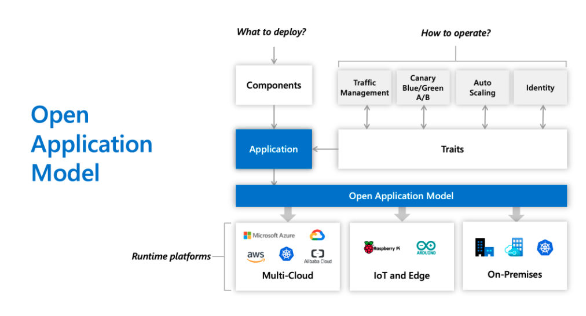

An open standard for defining cloud native apps.

Focused on application rather than container or orchestrator, Open Application Model [OAM] brings modular, extensible, and portable design for modeling application deployment with higher level yet consistent API.

This is the key to enable simple yet robust application delivery across hybrid environments including Kubernetes, cloud, or even IoT devices.

## Overview

### 1. Traditional Way - App Deployment is Hard

1. Developers spend time on infrastructure details instead of apps - ingress, labels, DNS, etc, and learning how the infrastructure is implemented.
2. Inextensible - upper layer platform may be introduced, but it's almost certain that the needs of your app will outgrow the capabilities of that platform soon.
3. Runtime lock-in - app description is tightly coupled with the runtime infrastructure, which heavily impact on how you configure, develop and operate the app across hybrid environments.

### 2. The OAM Way - An App-centric Approach

1. Application first - define the app with a self-contained model, where operational behaviors as part of app definition, free of infrastructure here.
2. Clarity and extensibility - an open standard to modularize platform capabilities into reusable pieces, assemble them into an app deployment per your own needs, fully self-service.
3. Runtime agnostic - a consistent experience to deploy and operate your apps across on-prem clusters, cloud providers or even edge devices.

## Introduction

> "Developers think in terms of application architecture, not of infrastructure."

## Overview of the Model

> https://github.com/oam-dev/spec/blob/master/2.overview_and_terminology.md

This specification proposes a model that defines cloud native applications as follows:

> A cloud native application is a collection of interrelated, but discrete components (services, tasks, workers) that, when coupled with configuration and instantiated in a suitable runtime, together accomplish a unified functional purpose.

In current release, this application model defines the following:

- Components represents a runnable unit, together with a description (schematic).
- Workload types identify the different workloads that a component can execute.
- Traits are overlays that augment a component with additional operations-specific features. Traits represent operator concerns, not developer/software owner concerns.
- Application scopes represent application boundaries by grouping components with common properties or dependencies.
- An application configuration assembles a set of component instances, their traits, and the application scopes in which they are placed, combined with configuration parameters and metadata.

Thus, an application is a collection of components with a set of operational traits and scoped together into one or more application boundaries.

## See it in action

> https://github.com/oam-dev/kubevela
