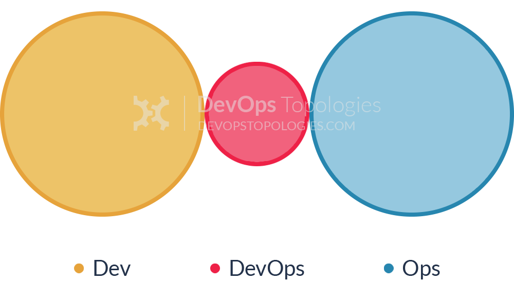
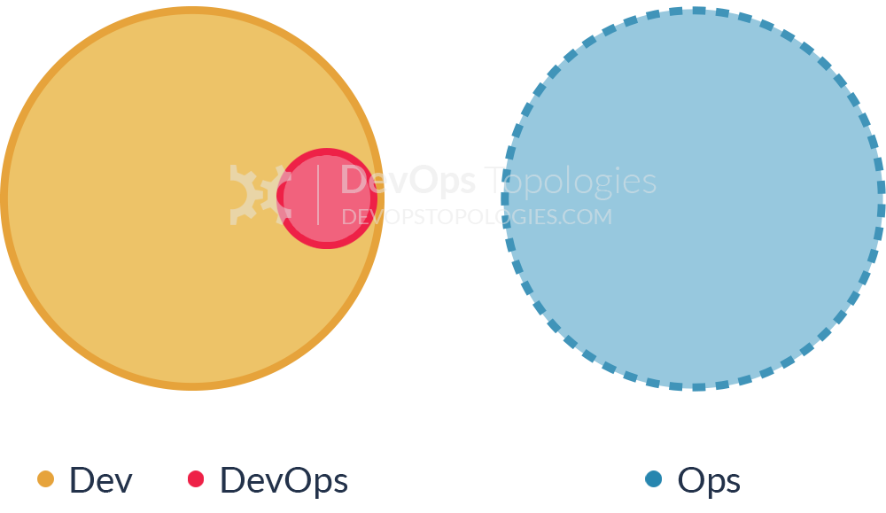
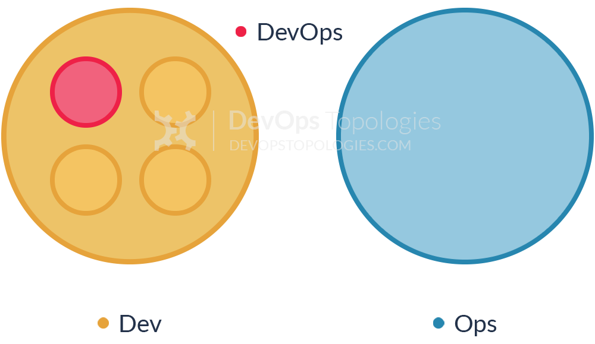
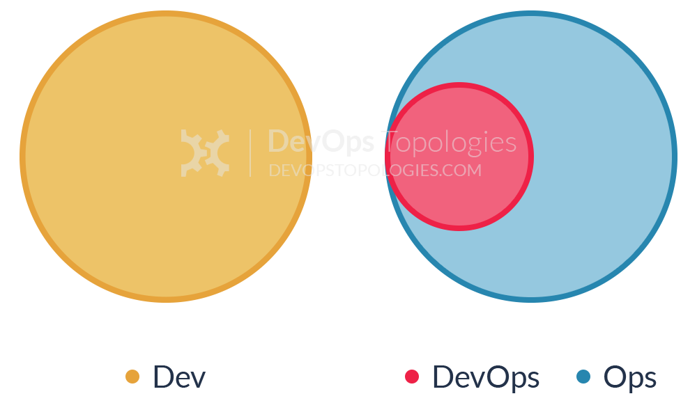
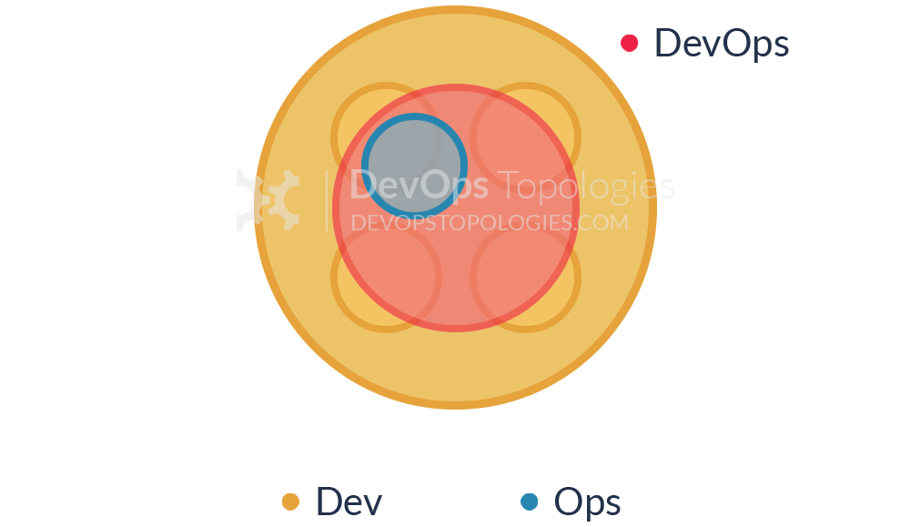
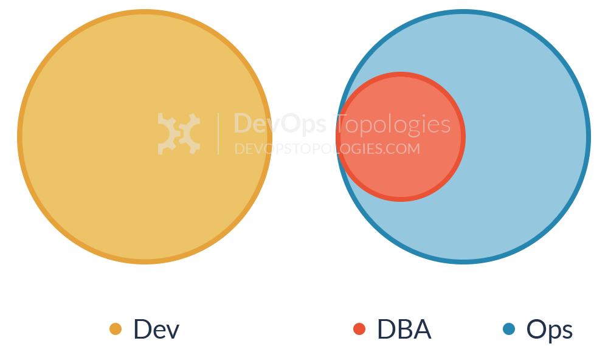

## **Anti-Type A:** Dev and Ops Silos

This is the classic ‘throw it over the wall’ split between Dev and Ops. It means that story points can be claimed early (DONE means ‘feature-complete’, but not working in Production), and software operability suffers because Devs do not have enough context for operational features and Ops folks do not have time or inclination to engage Devs in order to fix the problems before the software goes live.

We likely all know this topology is bad, but I think there are actually worse topologies; at least with Anti-Type A (Dev and Ops Silos), we know there is a problem.

## **Anti-Type B:** DevOps Team Silo

The DevOps Team Silo (Anti-Type B) typically results from a manager or exec deciding that they “need a bit of this DevOps thing” and starting a ‘DevOps team’ (probably full of people known as ‘a DevOp‘). The members of the DevOps team quickly form another silo, keeping Dev and Ops further apart than ever as they defend their corner, skills, and toolset from the ‘clueless Devs’ and ‘dinosaur Ops’ people.

The only situation where a separate DevOps silo really makes sense is when the team is temporary, lasting less than (say) 12 or 18 months, with the express purpose of bringing Dev and Ops closer together, and with a clear mandate to make the DevOps team superfluous after that time; this becomes what I have called a [Type 5 DevOps Topology](https://web.devopstopologies.com/#type-five).

## **Anti-Type C:** Dev Don't Need Ops

This topology is borne of a combination of naivety and arrogance from developers and development managers, particularly when starting on new projects or systems. Assuming that Ops is now a thing of the past (“we have the Cloud now, right?”), the developers wildly underestimate the complexity and importance of operational skills and activities, and believe that they can do without them, or just cover them in spare hours.

Such an Anti-Type C DevOps topology will probably end up needing either a [Type 3 (Ops as IaaS)](https://web.devopstopologies.com/#type-three) or a [Type 4 (DevOps-as-a-Service)](https://web.devopstopologies.com/#type-four) topology when their software becomes more involved and operational activities start to swamp ‘development’ (aka coding) time. If only such teams recognised the importance of Operations as a discipline as important and valuable as software development, they would be able to avoid much pain and unnecessary (and quite basic) operational mistakes

## **Anti-Type D:** DevOps as Tools Team

In order to "become DevOps" without losing current dev teams velocity (read delivery of functional stories), a DevOps team is set up to work on the tooling required for deployment pipelines, configuration management, environment management, etc. Meanwhile Ops folks continue to work in isolation and Dev teams continue to throw them applications "over the wall".

Although the outcomes of this dedicated team can be beneficial in terms of an improved tool chain, its impact is limited. The fundamental problem of lack of early Ops involvement and collaboration in the application development lifecycle remains unchanged.

## **Anti-Type E:** Rebranded SysAdmin

This anti-type is typical in organizations with low engineering maturity. They want to improve their practices and reduce costs, yet they fail to see IT as a core driver of the business. Because industry successes with DevOps are now evident, they want to "do DevOps" as well. Unfortunately, instead of reflecting on the gaps in the current structure and relationships, they take the elusive path of hiring "DevOps engineers" for their Ops team(s).

DevOps becomes just a rebranding of the role previously known as SysAdmin, with no real cultural/organizational change taking place. This anti-type is becoming more and more widespread as unscrupulous recruiters jump on the bandwagon searching for candidates with automation and tooling skills. Unfortunately, it's the human communication skills that can make DevOps thrive in an organization.

## **Anti-Type F:** Ops Embedded in Dev Team

The organization does not want to keep a separate Ops team, so development teams take responsibility for infrastructure, managing environments, monitoring, etc. However, doing so in a project or product-driven way means those items are subject to resource constraints and re-prioritizations which lead to subpar approaches and half-baked solutions.

In this anti-type the organization shows lack of appreciation for the importance and skills required for effective IT operations. In particular, the value of Ops is diminished because it's treated as an annoyance for Devs (as Ops is managed by a single Dev team manager with other priorities).

*Thanks to [Scott Prugh](https://twitter.com/ScottPrugh) for suggesting clarifications on how Anti-Type F differs from Type 2.*

## **Anti-Type G:** Dev and DBA Silos

This is a form of [Anti-Type A (Dev and Ops Silos)](https://web.devopstopologies.com/#anti-type-a) which is prominent in medium-to-large companies where multiple legacy systems depend on the same core set of data. Because these databases are so vital for the business, a dedicated DBA team, often under the Ops umbrella, is responsible for their maintenance, performance tuning and disaster recovery. That is understandable. The problem is when this team becomes a gate keeper for any and every database change, effectively becoming an obstacle to small and frequent deployments (a core tenet of DevOps and Continuous Delivery).

Furthermore, just like Ops in [Anti-Type A](https://web.devopstopologies.com/#anti-type-a), the DBA team is not involved early in the application development, thus data problems (migrations, performance, etc) are found late in the delivery cycle. Coupled with the overload of supporting multiple applications databases, the end result is constant firefighting and mounting pressure to deliver.

