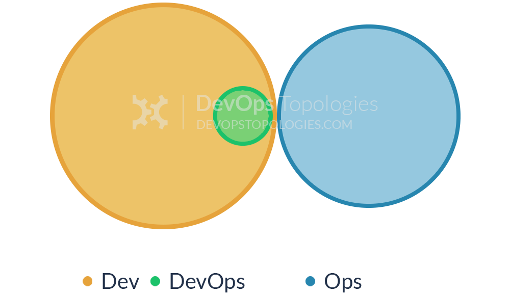
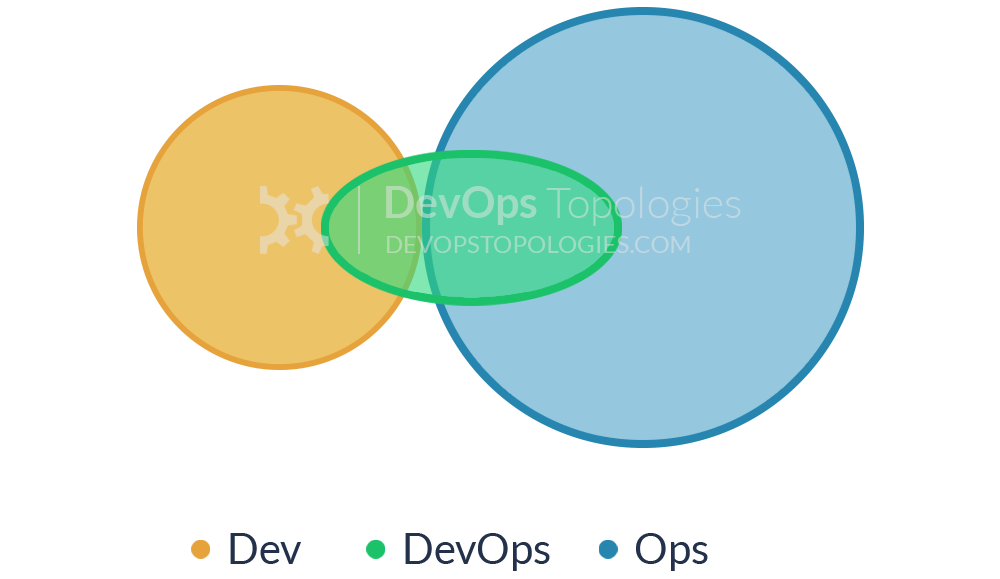
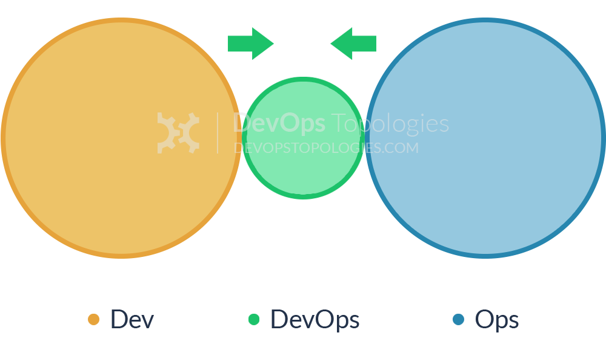
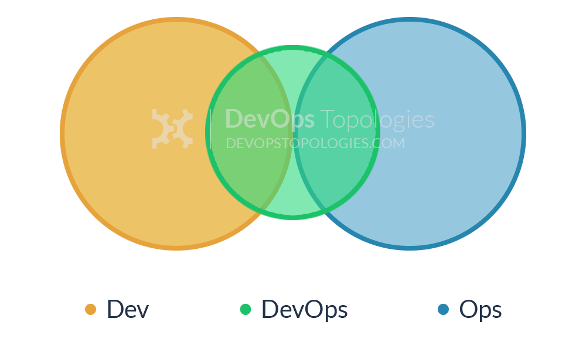
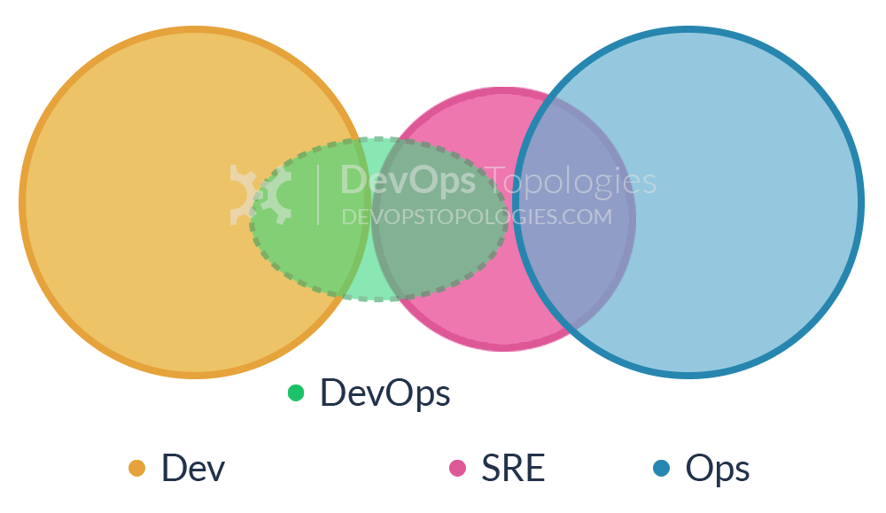
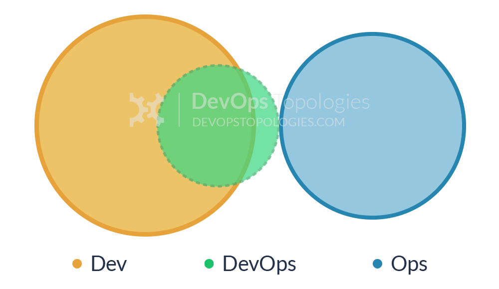
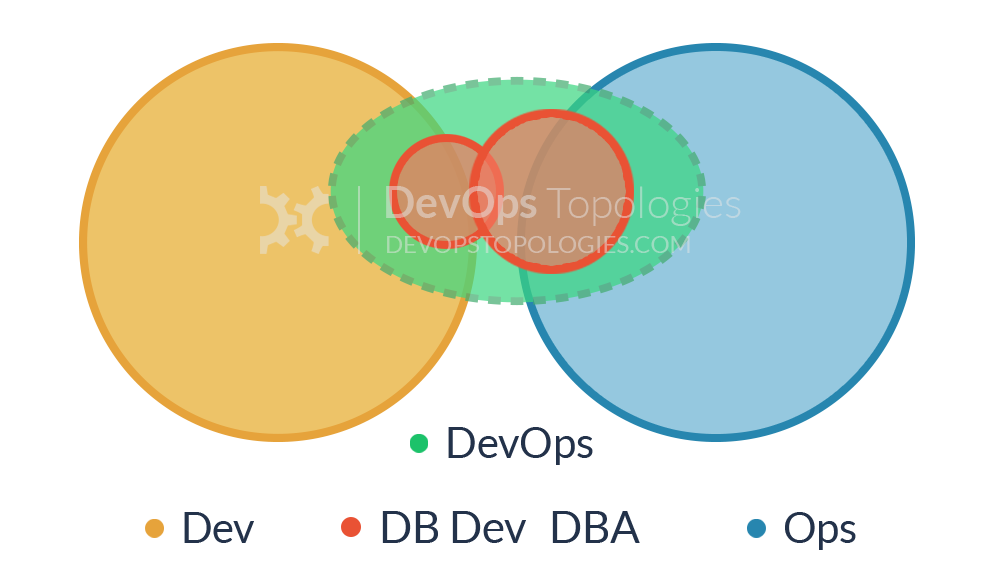

> https://web.devopstopologies.com/ | 2021-10-06

## **Type 1:** Dev and Ops Collaboration

This is the ‘promised land’ of DevOps: smooth collaboration between Dev teams and Ops teams, each specialising where needed, but also sharing where needed. There are likely many separate Dev teams, each working on a separate or semi-separate product stack.

My sense is that this Type 1 model needs quite substantial organisational change to establish it, and a good degree of competence higher up in the technical management team. Dev and Ops must have a clearly expressed and demonstrably effective shared goal (‘Delivering Reliable, Frequent Changes’, or whatever). Ops folks must be comfortable pairing with Devs and get to grips with test-driven coding and Git, and Devs must take operational features seriously and seek out Ops people for input into logging implementations, and so on, all of which needs quite a culture change from the recent past.

> **Type 1 suitability:** an organisation with strong technical leadership.
> **Potential effectiveness:** **HIGH**

## **Type 2:** Fully Shared Ops Responsibilities

Where operations people have been integrated in product development teams, we see a Type 2 topology. There is so little separation between Dev and Ops that all people are highly focused on a shared purpose; this is arguable a form of [Type 1 (Dev and Ops Collaboration)](https://web.devopstopologies.com/#type-one), but it has some special features.

Organisations such as Netflix and Facebook with effectively a single web-based product have achieved this Type 2 topology, but I think it’s probably not hugely applicable outside a narrow product focus, because the budgetary constraints and context-switching typically present in an organisation with multiple product streams will probably force Dev and Ops further apart (say, back to a [Type 1 model](https://web.devopstopologies.com/#type-one)). This topology might also be called ‘NoOps‘, as there is no distinct or visible Operations team (although the Netflix NoOps might also be [Type 3 (Ops as IaaS)](https://web.devopstopologies.com/#type-three)).

> **Type 2 suitability:** organisations with a single main web-based product or service.
> **Potential effectiveness:** **HIGH**

## **Type 3:** Ops as Infrastructure-as-a-Service (Platform)

For organisations with a fairly traditional IT Operations department which cannot or will not change rapidly [enough], and for organisations who run all their applications in the public cloud (Amazon EC2, Rackspace, Azure, etc.), it probably helps to treat Operations as a team who simply provides the elastic infrastructure on which applications are deployed and run; the internal Ops team is thus directly equivalent to Amazon EC2, or Infrastructure-as-a-Service.

A team (perhaps a virtual team) within Dev then acts as a source of expertise about operational features, metrics, monitoring, server provisioning, etc., and probably does most of the communication with the IaaS team. This team is still a Dev team, however, following standard practices like TDD, CI, iterative development, coaching, etc.

The IaaS topology trades some potential effectiveness (losing direct collaboration with Ops people) for easier implementation, possibly deriving value more quickly than by trying for [Type 1 (Dev and Ops Collaboration)](https://web.devopstopologies.com/#type-one) which could be attempted at a later date.

> **Type 3 suitability:** organisations with several different products and services, with a traditional Ops department, or whose applications run entirely in the public cloud.
> **Potential effectiveness:** **MEDIUM**

## **Type 4:** DevOps as an External Service

Some organisations, particularly smaller ones, might not have the finances, experience, or staff to take a lead on the operational aspects of the software they produce. The Dev team might then reach out to a service provider like Rackspace to help them build test environments and automate their infrastructure and monitoring, and advise them on the kinds of operational features to implement during the software development cycles.

What might be called DevOps-as-a-Service could be a useful and pragmatic way for a small organisation or team to learn about automation, monitoring, and configuration management, and then perhaps move towards a [Type 3 (Ops as IaaS)](https://web.devopstopologies.com/#type-three) or even [Type 1 (Dev and Ops Collaboration)](https://web.devopstopologies.com/#type-one) model as they grow and take on more staff with operational focus.

> **Type 4 suitability:** smaller teams or organisations with limited experience of operational issues.
> **Potential effectiveness:** **MEDIUM**

## **Type 5:** DevOps Team with an Expiry Date

The DevOps Team with an Expiry Date (Type 5) looks substantially like [Anti-Type B (DevOps Team Silo)](https://web.devopstopologies.com/#anti-type-b), but its intent and longevity are quite different. This temporary team has a mission to bring Dev and Ops closer together, ideally towards a [Type 1 (Dev and Ops Collaboration)](https://web.devopstopologies.com/#type-one) or [Type 2 (Fully Shared Ops Responsibilities)](https://web.devopstopologies.com/#type-two) model, and eventually make itself obsolete.

The members of the temporary team will ‘translate’ between Dev-speak and Ops-speak, introducing crazy ideas like stand-ups and Kanban for Ops teams, and thinking about dirty details like load-balancers, management NICs, and SSL offloading for Dev teams. If enough people start to see the value of bringing Dev and Ops together, then the temporary team has a real chance of achieving its aim; crucially, long-term responsibility for deployments and production diagnostics should not be given to the temporary team, otherwise it is likely to become a [DevOps Team Silo (Anti-Type B).](https://web.devopstopologies.com/#anti-type-b)

> **Type 5 suitability:** as a precursor to [Type 1 topology](https://web.devopstopologies.com/#type-one), but beware the danger of [Anti-Type B](https://web.devopstopologies.com/#anti-type-b).
> **Potential effectiveness:** **LOW to HIGH**

## **Type 6:** DevOps Advocacy Team

Within organisations that have a large gap between Dev and Ops (or the tendency towards a large gap), it can be effective to have a 'facilitating' DevOps team that keeps the Dev and Ops sides talking. This is a version of [Type 5 (DevOps Team with an Expiry Date)](https://web.devopstopologies.com/#type-five) but where the DevOps team exists on an ongoing basis with the specific remit of facilitating collaboration and cooperation between Dev and Ops teams. Members of this team are sometimes called 'DevOps Advocates', because they help to spread awareness of DevOps practices.

>  [The goal for a "DevOps Team" should be to put itself out of business by enabling the rest of the org.](https://twitter.com/ericminick/status/517335119330172930)

> **Type 6 suitability:** organisations with a tendency for Dev and Ops to drift apart. Beware the danger of [Anti-Type B.](https://web.devopstopologies.com/#anti-type-b)
> **Potential effectiveness:** **MEDIUM to HIGH**

## **Type 7:** SRE Team (Google Model)

DevOps often recommends that Dev teams join the on-call rotation, but it's not essential. In fact, some organisations (including Google) run a different model, with an explicit 'hand-off' from Development to the team that runs the software, the Site Reliability Engineering (SRE) team. In this model, the Dev teams need to provide test evidence (logs, metrics, etc.) to the SRE team showing that their software is of a good enough standard to be supported by the SRE team.

Crucially, the SRE team can reject software that is operationally substandard, asking the Developers to improve the code before it is put into Production. Collaboration between Dev and SRE happens around operational criteria but once the SRE team is happy with the code, they (and not the Dev team) support it in Production.

> **Type 7 suitability:** Type 7 is suitable only for organisations with a high degree of engineering and organisational maturity. Beware of a return to [Anti-Type A](https://web.devopstopologies.com/#anti-type-a) if the SRE/Ops team is told to "JFDI" deploy.
> **Potential effectiveness:** **LOW to HIGH**

## **Type 8:** Container-Driven Collaboration

Containers remove the need for some kinds of collaboration between Dev and Ops by encapsulating the deployment and runtime requirements of an app into a container. In this way, the container acts as a boundary on the responsibilities of both Dev and Ops. With a sound engineering culture, the Container-Driven Collaboration model works well, but if Dev starts to ignore operational considerations this model can revert towards to an adversarial 'us and them'.

> **Type 8 suitability:** Containers can work very well, but beware [Anti-Type A](https://web.devopstopologies.com/#anti-type-a), where the Ops team is expected to run anything that Dev throws at it.
> **Potential effectiveness:** **MEDIUM to HIGH**

## **Type 9:** Dev and DBA Collaboration

In order to bridge the Dev-DBA chasm, some organisations have experimented with something like Type 9, where a database capability from the DBA team is complimented with a database capability (or specialism) from the Dev team. This seems to help to translate between the Dev-centric view of databases (as essentially dumb persistence stores for apps) and the DBA-centric view of databases (smart, rich sources of business value).

> **Type 9 suitability:** for organisations with one or more large, central databases with multiple connected applications.
> **Potential effectiveness:** **MEDIUM**
