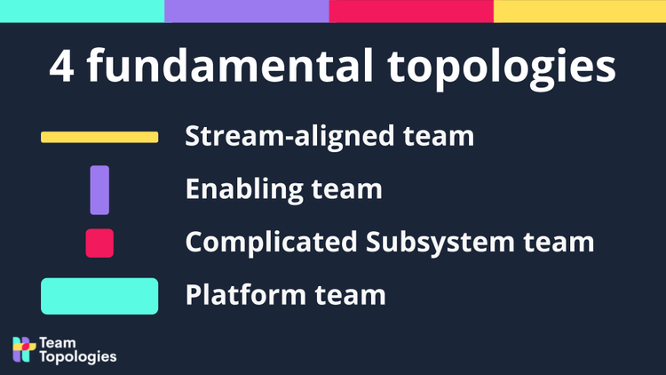
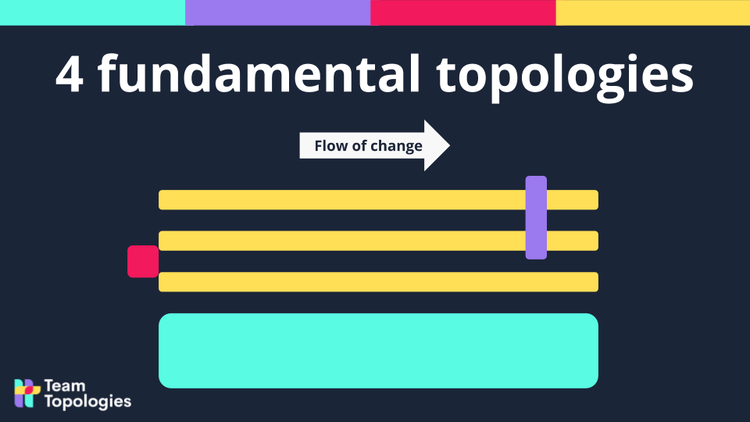
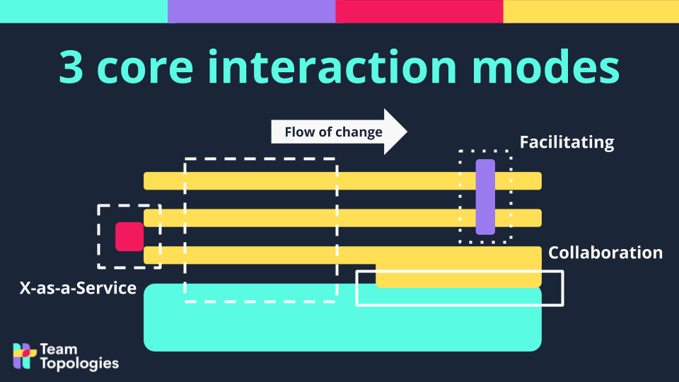

## Four Fundamental Topologies

- Stream-aligned team: aligned to a flow of work from (usually) a segment of the business domain
- Enabling team: helps a Stream-aligned team to overcome obstacles. Also detects missing capabilities.
- Complicated Subsystem team: where significant mathematics/calculation/technical expertise is needed.
- Platform team: a grouping of other team types that provide a compelling internal product to accelerate delivery by Stream-aligned teams

## Four Fundamental Topologies - With The Flow Of Change

The flow of change is shown left-to-right. Stream-aligned teams own an entire slice of the business domain (or other flow) end-to-end. The Stream-aligned teams are “You Built It, You Run It” teams. There are no hand-offs to other teams for any purpose.

This diagram is a snapshot in time. The team relationships WILL change as new goals are set and the teams discover new things.

## Three Team Interaction Modes

There are only three ways in which team should interact:

- Collaboration: working together for a defined period of time to discover new things (APIs, practices, technologies, etc.)
- X-as-a-Service: one team provides and one team consumes something “as a Service”
- Facilitation: one team helps and mentors another team

## Additional Resources

- https://teamtopologies.com/
- https://github.com/TeamTopologies/
- [Useful tools and guides for team-first organization design for software delivery](https://teamtopologies.com/resources)
- [Team Topologies Distilled](https://academy.teamtopologies.com/courses/team-topologies-distilled)

